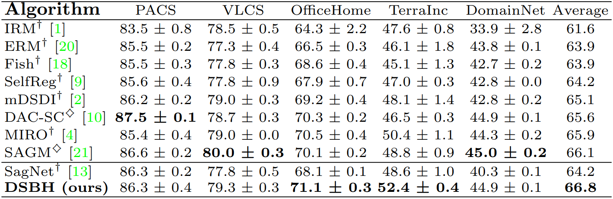

# Dynamic Spuriosity Bias Harmonizer (PAKDD 2025)
This repository provides the official implementation of **Dynamic Spuriosity Bias Harmonizer (DSBH)**, 
which was accepted at **PAKDD 2025**. The method is built upon [miro](https://github.com/khanrc/miro).

## Preparation
### Environments
First, create and activate a virtual environment (optional but recommended):
```
conda create -n dsbh python=3.8
conda activate dsbh
```

Then, install the required packages:
```
pip install -r requirements.txt
```

Below are the software dependencies and package versions used in this project:
```
Python: 3.6.13
PyTorch: 1.7.1+cu110
Torchvision: 0.8.2+cu110
CUDA: 11.0
CUDNN: 8005
NumPy: 1.19.5
PIL: 8.4.0
```

### Dataset
Download the datasets using the following command:
```
python -m domainbed.scripts.download --data_dir /path/to/dataset
```
Replace `/path/to/dataset` with the actual directory where you want to store the dataset.

### Train a model
To train the model, use the following command:
```
python train_all.py --data_dir /path/to/dataset --algorithm DSBH \
    --dataset PACS \
    --lr 3e-5 \
    --resnet_dropout 0.2 \
    --weight_decay 9e-6 \
    --trial_seed 0
```

Our hyperparameters:
## Hyperparameters
|                     | PACS  | VLCS  | OfficeHome | TerraIncognita | DomainNet |
|-------------------- |------ |------ |-----------|--------------|-----------|
| **Learning rate**   | 3e-5  | 8e-6  | 1e-5      | 3e-5         | 2e-5      |
| **Weight decay**    | 9e-6  | 1e-6  | 3e-6      | 5e-6         | 1e-6      |
| **Dropout**         | 0.2   | 0.5   | 0.0       | 0.25         | 0.2       |
| **λ_grad**         | 0.9   | 0.4   | 0.4       | 0.6          | 0.4       |
| **λ_logit**        | 0.1   | 0.4   | 1.0       | 0.4          | 0.3       |

## Main Results
The following table presents a comparison of **DSBH** with existing domain generalization methods. 
Results are reported as accuracy (%) and are averaged over three random seeds.


